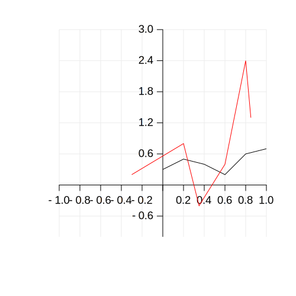

# Plot
This function does not depend on GRM. It makes easy plotting data into a file instead of into a window.

For example:
```nim
import gr

let ds1 = Dataset( x: @[0.0, 0.2, 0.4, 0.6, 0.8, 1.0],
                   y: @[0.3, 0.5, 0.4, 0.2, 0.6, 0.7] )
let ds2 = Dataset( x: @[-0.3, 0.2, 0.35, 0.6, 0.8, 0.85],
                   y: @[0.2, 0.8, -0.4, 0.4, 2.4, 1.3] )                    
plot(@[ds1, ds2], "example.png")
plot(@[ds1, ds2], "example.svg")

```
creates:

## example.png


## example.svg


